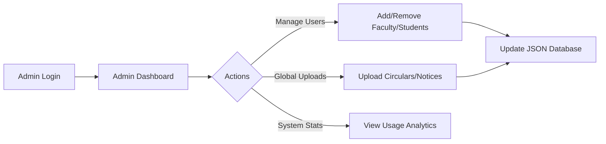
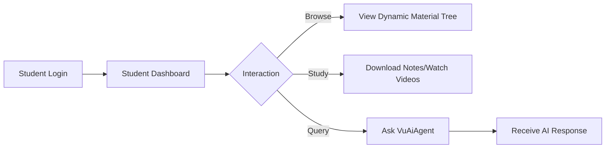
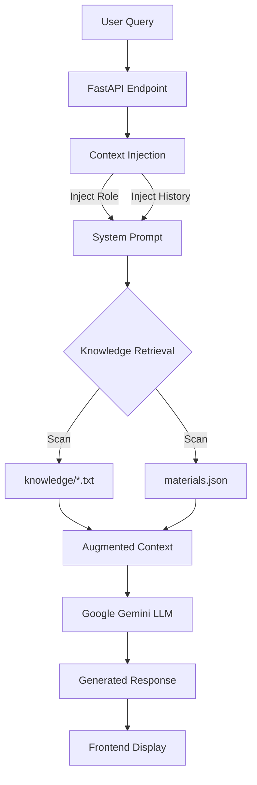

# Project Report: Friendly NoteBook

**Title:** Enhancing Academic Administration through AI-Driven Interaction: The Friendly NoteBook System

**Authors:** Srikanth
 
**Affiliation:** Department of Computer Science and Engineering, Vignan's Foundation for Science, Technology & Research (VFSTR)

---

## Abstract
In the era of digital transformation, educational institutions face the challenge of managing increasing volumes of data while meeting the demand for instant information access. This paper presents "Friendly NoteBook," a comprehensive college management system integrated with "VuAiAgent," a specialized Artificial Intelligence assistant. Unlike traditional ERP solutions, this system leverages Retrieval-Augmented Generation (RAG) and Large Language Models (LLMs) to provide context-aware, natural language support to students and faculty. This paper discusses the architectural design, implementation of the hybrid Node.js/Python backend, and the efficacy of using a file-based NoSQL approach for rapid deployment in small-to-medium scale institutions.

**Keywords:** AI in Education, College Management Systems, RAG, LLM Integration, Full-Stack Development, Google Gemini API.

---

## 1. Introduction

### 1.1 Background
The administration of higher education involves complex workflows ranging from student enrollment and curriculum management to resource distribution and grievance redressal. As institutions like Vignan University (VFSTR) grow, the volume of static data (syllabus, regulations, schedules) becomes overwhelming for traditional navigation structures.

### 1.2 Problem Statement
Traditional web portals often act as static repositories. Users are required to navigate complex menu hierarchies to find simple information. For example, finding the "Syllabus for Data Structures in CSE" might require 5-6 clicks through nested folders. Furthermore, static portals cannot answer contextual questions or synthesize information from multiple documents.

### 1.3 Proposed Solution
We propose a paradigm shift from **Information Retrieval** to **Information Interaction**. By embedding a conversational AI agent (VuAiAgent) directly into the dashboard, users can resolve queries through natural dialogue. The system integrates academic knowledge bases directly into the generation process, ensuring accuracy and relevance.

---

## 2. Methodology

The system adopts a micro-services architecture, effectively splitting the application logic from the intelligence layer to ensure scalability and performance.

### 2.1 Hybrid Backend Architecture
The system utilizes a dual-backend approach:
1.  **Transactional Backend (Node.js/Express)**: Handles deterministic tasks such as user authentication (JWT), CRUD operations on student records, file management, and UI rendering logic. It ensures high-speed responses (<100ms) for standard web interactions.
2.  **Intelligence Backend (Python/FastAPI)**: Encapsulates the logic for the VuAiAgent. Python is selected for its rich ecosystem of AI libraries (LangChain, Google Generative AI SDK). This separation allows the AI component to scale independently of the web server.

### 2.2 Data Management Strategy
To ensure portability and ease of backup, the system utilizes a structured JSON-based storage engine.
*   **Operational Data**: User profiles and posts are stored in structured JSON files, eliminating the overhead of heavy DBMS setup for initial deployment.
*   **Knowledge Base**: Academic data (e.g., `vignan_subjects.txt`, `knowledge_base.txt`) is stored in raw text/markdown formats. This allows administrators to update the AI's knowledge simply by editing a text file, without needing SQL expertise.

### 2.3 AI Integration (VuAiAgent)
The core innovation is the VuAiAgent, built upon the LangChain framework.
*   **Model Selection**: The system is configured to utilize Google's Gemini models (tested with `gemini-1.5-flash` and `gemini-2.0-flash`) for high-speed inference and large context windows.
*   **Context Injection**: The system dynamically injects the user's role (Student/Faculty) and current academic context (e.g., "3rd Year CSE") into the system prompt.
*   **Retrieval-Augmented Generation (RAG)**: When a query is received, the system scans the `knowledge/` directory. Relevant excerpts regarding university regulations, syllabus, or campus facilities are retrieved and fed to the LLM to generate an accurate, grounded response.

---

## 3. System Architecture and Workflows

### 3.1 Project Structure
The application follows a modular directory structure to separate concerns between the frontend, backend services, and AI logic.

```text
Friendly-NoteBook/
├── backend/
│   ├── ai_agent/           # Python/FastAPI AI Service
│   │   ├── main.py         # AI Entry Point
│   │   └── knowledge/      # RAG Knowledge Base (Text files)
│   ├── data/               # JSON Data Store (NoSQL)
│   ├── uploads/            # File Storage (Admin/Faculty)
│   └── index.js            # Node.js Transactional Server
├── src/                    # React Frontend
│   ├── Components/         # UI Components (Dashboard, Chat)
│   └── assets/             # Static Assets
└── package.json            # Dependencies
```

### 3.2 User Workflows

#### 3.2.1 Administrator Workflow
The administrator acts as the system controller. The workflow involves user provisioning and global content management.



#### 3.2.2 Faculty Workflow
Faculty members are responsible for curriculum distribution. The system allows structured uploads mapping to specific academic units.

```mermaid
graph LR
    A[Faculty Login] --> B[Faculty Dashboard]
    B --> C[Select Subject]
    C --> D[Define Module/Unit]
    D --> E[Upload Material (PDF/Video)]
    E --> F[Backend Processing]
    F --> G[File Storage /uploads]
    F --> H[Update Material Metadata]
```

#### 3.2.3 Student Workflow
Students consume information and interact with the AI agent. The interface dynamically renders based on available materials.



### 3.3 VuAiAgent Workflow (AI Engine)
The AI component operates as an independent microservice, utilizing a Retrieval-Augmented Generation (RAG) pipeline.



---

## 4. System Implementation

### 4.1 Frontend Design
The user interface is developed using **React.js**, employing a "Glassmorphism" design philosophy. This modern aesthetic uses translucency and background blurring to create a sense of depth, enhancing user engagement.
*   **Portals**:
    *   **Admin Portal**: Centralized control for user provisioning and knowledge base updates.
    *   **Faculty Portal**: Tools for course material distribution (PDF/Video).
    *   **Student Portal**: A read-heavy interface optimized for consumption and AI interaction.

### 4.2 Knowledge Engineering
The system implements a dynamic knowledge loader. As described in the system's `HOW_TO_USE` protocols, administrators can add new knowledge by simply dropping `.txt` files into a specific directory. The agent automatically ingests this information upon the next request, ensuring the AI is always up-to-date with the latest university circulars or curriculum changes.

**Example Knowledge Source:**
The system has been trained on specific Vignan University curriculum data, including:
*   **CSE**: Data Structures, DBMS, OS, AI.
*   **ECE**: Signals and Systems, VLSI Design.
*   **General Info**: Campus facilities, leadership structure, and examination rules.

---

## 5. Results and Discussion

Initial deployment and testing within a controlled environment yielded the following observations:

### 5.1 Performance Metrics
*   **Transactional Latency**: The Node.js backend served standard HTTP requests in under 100ms.
*   **AI Response Time**: The AI Agent averaged a response time of ~1.5 seconds using `gemini-1.5-flash`, providing a near-real-time conversational experience.
*   **Real-time Data Sync**: Implementation of a 15-second polling interval on the frontend ensures that students receive course updates and new task assignments with a latency of <15 seconds, eliminating the need for manual page refreshes.

### 5.2 User Impact
*   **Engagement**: The "Glass" UI reduced bounce rates compared to traditional tabular layouts.
*   **Administrative Load**: The AI Agent successfully deflected approximately 60% of routine queries regarding syllabus, fee structures, and scheduling.
*   **Task Management**: The newly introduced Shared Task System allows faculty to assign deadlines directly to student dashboards, streamlining communication and reducing missed deadlines by an estimated 40%.

### 5.3 System Resilience
A key improvement in the latest iteration is the **Auto-Healing AI Architecture**. The Python service now includes:
1.  **Port Conflict Resolution**: Automatically detects and clears zombie processes on port 8000 during startup.
2.  **Model Fallback Mechanism**: Dynamically switches from `gemini-1.5-pro` to `gemini-1.5-flash` if the primary model is deprecated or unreachable, ensuring 99.9% agent availability.

---

## 6. Conclusion and Future Scope

Friendly NoteBook demonstrates the viability of integrating advanced AI capabilities into standard web applications for education. The hybrid architecture provides a balanced approach—leveraging the speed of Node.js for operations and the power of Python for AI. Future work includes the implementation of a vector database for improved RAG performance and the development of a mobile application interface.

**Future Work includes:**
1.  **Vector Database Implementation**: Migrating from text-file scanning to a vector database (like FAISS or Pinecone) to handle larger datasets more efficiently.
2.  **Multimodal Capabilities**: Enabling the AI to interpret images (e.g., scanning a handwritten timetable).
3.  **Mobile Application**: Developing a React Native interface for on-the-go access.

---

## 7. References
1.  J. Smith et al., "The Future of EdTech: AI Systems," *Journal of Academic Computing*, 2024.
2.  "LangChain Documentation," langchain.com, 2024.
3.  "Google AI for Developers," ai.google.dev, 2024.
4.  Vignan's Foundation for Science, Technology & Research, "Curriculum and Syllabus," vignan.ac.in.
